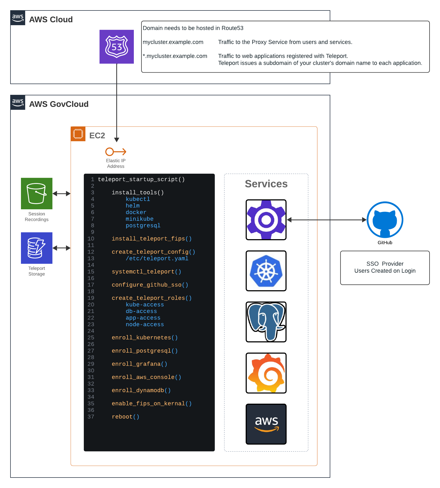

# Deploy Teleport Cluster




## Docs
* [Self Hosted Cluster](https://goteleport.com/docs/admin-guides/deploy-a-cluster/linux-demo/)
* [Kubernetes Access](https://goteleport.com/docs/enroll-resources/kubernetes-access/getting-started/)
* [Postgresql](https://goteleport.com/docs/enroll-resources/database-access/enroll-self-hosted-databases/postgres-self-hosted/)
* [Grafana](https://goteleport.com/docs/enroll-resources/application-access/getting-started/)
* [AWS Console](https://goteleport.com/docs/enroll-resources/application-access/cloud-apis/aws-console/)
* [GitHub SSO](https://goteleport.com/docs/admin-guides/access-controls/sso/github-sso/#step-24-create-a-github-authentication-connector/)

### FedRAMP
* [What is FedRAMP](https://goteleport.com/learn/what-is-fedramp-compliance/)
* [Teleport Features for FedRAMP Controls](https://goteleport.com/use-cases/fedramp-compliance/)
* [FedRAMP Compliance for Infrastructure Access](https://goteleport.com/docs/admin-guides/access-controls/compliance-frameworks/fedramp/)
* [Accelerate FedRAMP Compliance with Teleport's Access Platform](https://goteleport.com/blog/accelerate-fedramp-compliance/)
* [YouTube: Simplifying FedRAMP Compliance with Teleport](https://www.youtube.com/watch?v=nGQ40LaDbvE)

### FIPS

* [Binary: Teleport Enterprise (FIPS) Edition](https://gallery.ecr.aws/gravitational/teleport-ent-fips-distroless)

* [Configuring AWS FIPS endpoints ](https://goteleport.com/docs/reference/backends/#configuring-aws-fips-endpoints)
  ```sh
  # This var tells Teleport to use FIPS for S3 and DynamoDB
  # use_fips_endpoint=true 

  # This var defaults FIPS for all AWS endpoints
  AWS_USE_FIPS_ENDPOINT=true 

  # Forces GovCloud STS Endpoint instead of Global Endpoint.
  AWS_STS_REGIONAL_ENDPOINTS=regional 
  AWS_REGION=us-gov-west-1
  ```
  > A warning about `AWS_USE_FIPS_ENDPOINT`
Setting this environment variable to true will enable FIPS endpoints for all AWS resource types. Some FIPS endpoints are not supported in certain regions or environments or are only supported in GovCloud.

* [Teleport Install](https://goteleport.com/docs/installation/#tar-archives-self-hosted-only)
  ```sh
  TELEPORT_VERSION="16.4.7"
  SYSTEM_ARCH="amd64"
  curl https://cdn.teleport.dev/teleport-ent-v${TELEPORT_VERSION?}-linux-${SYSTEM_ARCH?}-fips-bin.tar.gz.sha256
  curl -O https://cdn.teleport.dev/teleport-ent-v${TELEPORT_VERSION?}-linux-${SYSTEM_ARCH?}-fips-bin.tar.gz
  shasum -a 256 teleport-ent-v${TELEPORT_VERSION?}-linux-${SYSTEM_ARCH?}-fips-bin.tar.gz
  tar -xvf teleport-ent-v${TELEPORT_VERSION?}-linux-${SYSTEM_ARCH?}-fips-bin.tar.gz
  cd teleport-ent
  sudo ./install
  ```

* [systemctl fips teleport.service](https://github.com/gravitational/teleport/blob/branch/v16/examples/systemd/fips/teleport.service)
  ```sh
  [Unit]
  Description=Teleport Service FIPS
  After=network.target

  [Service]
  Type=simple
  Restart=always
  RestartSec=5
  EnvironmentFile=-/etc/default/teleport
  ExecStart=/usr/local/bin/teleport start --config /etc/teleport.yaml --fips --pid-file=/run/teleport.pid
  # systemd before 239 needs an absolute path
  ExecReload=/bin/sh -c "exec pkill -HUP -L -F /run/teleport.pid"
  PIDFile=/run/teleport.pid
  LimitNOFILE=524288

  [Install]
  WantedBy=multi-user.target
  ```

## Teleport license.pem

Teleport with FIPS enabled requries having a `license.pem`. This Demo expects the license.pem file to exist in the terraform folder.  

## Set Up GitHub SSO

1. Create GitHub Org
1. Create GitHub Team
1. Create GitHub OAuth App
1. Create OAuth App Secret

* Homepage URL: `https://mycluster.example.com`
* Callback URL: `https://mycluster.example.com/v1/webapi/github/callback`
* Enable Device Flow: `True`


## Create terraform.tfvars

`teleport_cluster_name` and `aws_dns_route53_zone` zone will be combined to make the Proxy Address. `my-teleport-cluster.mycompany.com`

This Demo uses 2 AWS Providers. One to create resource in GovCloud and one to create the DNS resources in a regular region.

```hcl
teleport_cluster_name = "my-teleport-cluster"
teleport_email        = "myuser@example.com"
teleport_version      = "16.4.7"

aws_gov_region     = "us-gov-west-1"
aws_gov_access_key = "QWERTYUABT3GN4GKY5R"
aws_gov_secret_key = "QWERTYUIOPSDFG/Dn1/i6CFizJmRkz17"

aws_dns_region       = "us-west-2"
aws_dns_route53_zone = "mycompany.com" 
aws_dns_access_key   = "ZXCVBNM<GTYUIO"
aws_dns_secret_key   = "+ASDFGHJKRTYUIl+c12345678905Cl"

gh_client_secret = "1234567890qwertyuiop1234567890"
gh_client_id     = "asdfghjklasdfghjkl"
gh_org_name      = "mycompany-org"
gh_team_name     = "admins"
```

## Run Terraform installer

You will need to authorize both of the AWS Providers before running terraform apply.

[AWS Provider](https://registry.terraform.io/providers/hashicorp/aws/latest/docs)

```sh
cd terraform
terraform apply
```

## Log into web app

Navigate to the cluster's URL and login with GitHub.

```sh
terraform output teleport_cluster_fqdn
```


### Launch Grafana App

Click launch on Grafana to connect to the app.


### Launch AWS Console

Click the `TeleportReadOnly` role to launch the AWS Console.


### Connect To EC2 Instance

Click the username you'd like connect with.


## Log into Teleport CLI

### Install Teleport Locally

[Teleport Install](https://goteleport.com/docs/installation/)

For MacOS (Homebrew is not recommended)
```sh
curl -O https://cdn.teleport.dev/teleport-16.4.7.pkg
sudo installer -pkg teleport-16.4.7.pkg -target /
which teleport
```

### Authenticate to Teleport Clsuter

We will be using the same GitHub Auth Connector we used for the web. Granting the same privliges on the CLI. 
```sh
eval "$(terraform output -raw teleport_tsh_login)"
tsh status
```

### Connect to SSH Node

ssh will default to the login address. 

```sh
tsh ls
tsh ssh $NODE_NAME
```

### Connect to PostgreSQL

```sh
tsh db ls
tsh db connect postgresql --db-user=teleport --db-name=teleport
```

### Connect to Kubernetes

```sh
tsh kube ls
tsh kube login minikube
kubectl get ns
```

### Connect to AWS CLI

Run AWS commands through the Teleport Binary
```sh
tsh apps ls
tsh apps login aws-console --aws-role TeleportReadOnly20241124230016265200000003
tsh aws s3 ls
tsh aws ec2 describe-instances
```

Start a proxy tunnel to use the normal AWS binary.
```sh
tsh proxy aws --app aws-console

Started AWS proxy on http://127.0.0.1:64985.
To avoid port randomization, you can choose the listening port using the --port flag.

Use the following credentials and HTTPS proxy setting to connect to the proxy:
  export AWS_ACCESS_KEY_ID=c020bf2e-6e17-4a05-b903
  export AWS_SECRET_ACCESS_KEY=f551de73-921e-4ac8-bc56
  export AWS_CA_BUNDLE=/Users/username/.tsh/keys/mycluster.teleport.com/username-app/mycluster.teleport.com/AWS-Console-localca.pem
  export HTTPS_PROXY=http://127.0.0.1:64985
```


## FAQ / Troubleshooting

## Check Installation

If you want to check on the status of the Cloud Init script use these commands to connect the ec2 instance and check the log.
```sh
eval "$(terraform output -raw teleport_cluster_ssh)"
cat /var/log/cloud-init-output.log
```

## ACME issues

Let's encrypt limits the number of times you can reissue a certficate. 

If you're seeing errors for `Original Error: *errors.errorString acme/autocert: missing server name` then changing the variable `teleport_cluster_name` should fix the issue. 